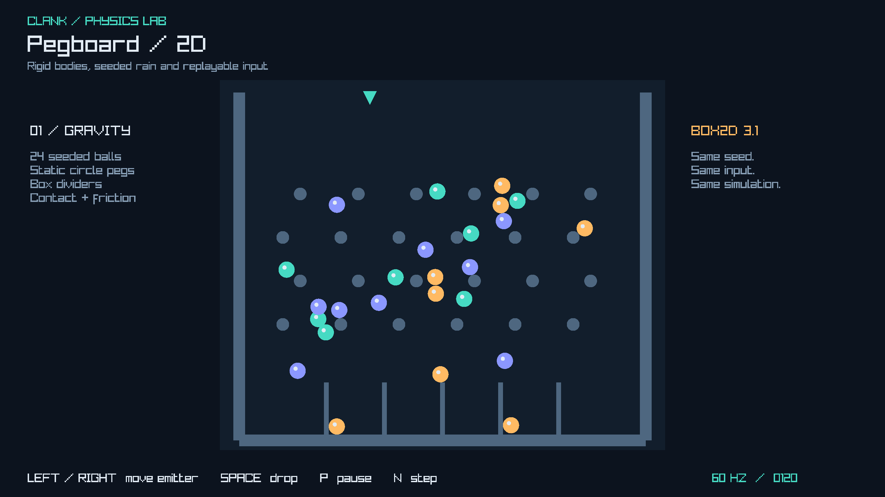
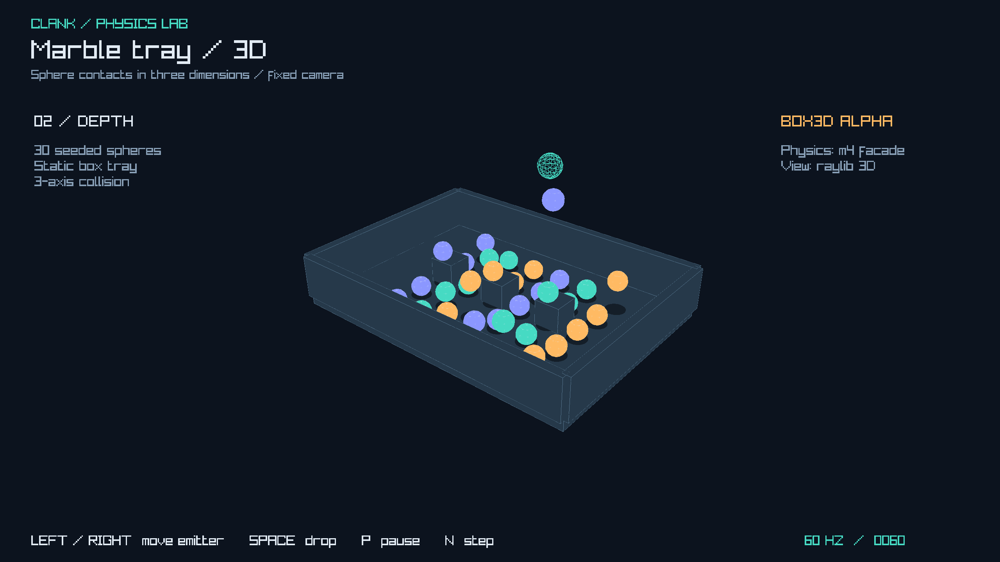

# Physics lab

Build from the repository root: `cmake -B build -G Ninja && cmake --build build`.

| Run | What to look for |
| --- | --- |
| `./build/pegboard` | Box2D circles split around static pegs and collect between box dividers. |
| `./build/marble_tray` | Box3D spheres fall, collide and roll around three blocks inside a box tray. |
| `./build/minimal` | Smallest scene JSON dump/load round trip; no window or input. |

The physics labs stay open until Escape. Left/Right moves the emitter; each Space
press adds one body (up to 128 total). P pauses; N advances one physics tick while
paused. Restart to reset. All physics steps use 1/60 s; live viewing is paced at
60 FPS. A slow display slows playback instead of skipping simulation ticks.




## Drive, dump, see

Run from the repository root; PNGs are written to the current directory:

```sh
./build/pegboard --shot-after 120 --replay examples/replays/drop.clk --dump-scene /tmp/pegboard.json --seed 42
./build/marble_tray --shot-after 60 --replay examples/replays/drop.clk --dump-scene /tmp/tray.json --seed 42
./build/pegboard --headless --shot-after 240 --replay examples/replays/drop.clk --dump-scene /tmp/replayed.json --seed 42
```

`--shot-after N` exits after exactly N ticks (0 captures the initial state).
Replay replaces live movement/drop input. Without a frame limit, headless runs
240 ticks. Output paths go to stdout; update timing p50/p95/p99 goes to stderr.
The same seed and replay reproduce scene JSON on the same build/backend.

**Current limits:** headless screenshots are the renderer's 1x1 placeholder.
For real pixels on Linux, prefix the windowed command with `xvfb-run -a`.
Views use raylib directly; m2 provides screenshots but has no 3D drawing API.
The 3D dump uses paired `.xy` and `.xz` entities to preserve X/Y/Z positions
and dimensions in the current 2D scene schema. It is an observation, not a
physics checkpoint. Dynamic spheres avoid claiming full rotation support
(the physics facade only exposes yaw). No assets or new dependencies are needed.

`ctest --test-dir build --output-on-failure` checks seeded replay, collisions,
bounds and CLI failures. Set `CLANK_WINDOWED_TEST=1` to also compare actual pixels
with the goldens (2% changed-pixel budget) and match windowed/headless scene dumps.
